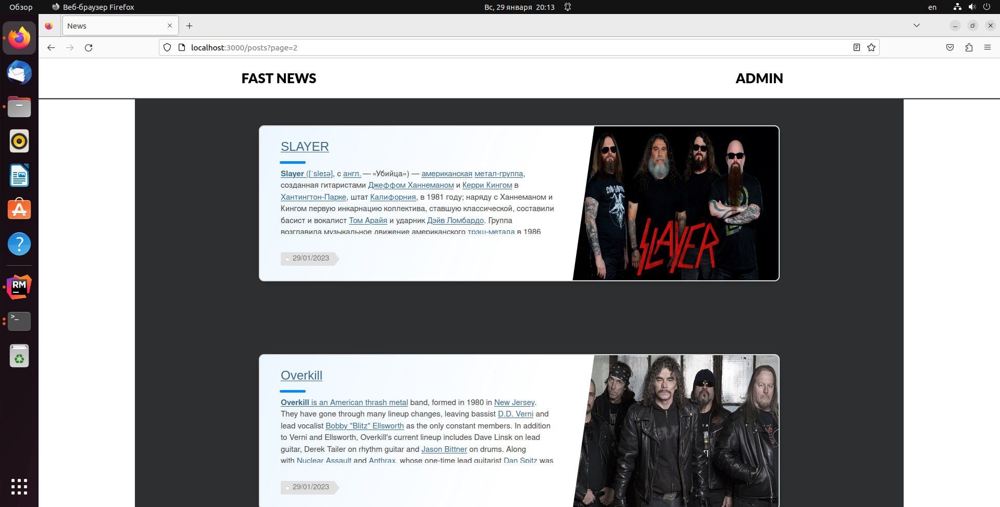

# README

<!--
*** Thanks for checking out this README Template. If you have a suggestion that would
*** make this better, please fork the repo and create a pull request or simply open
*** an issue with the tag "enhancement".
*** Thanks again! Now go create something AMAZING! :D
-->

<!-- PROJECT SHIELDS -->
<!--
*** I'm using markdown "reference style" links for readability.
*** Reference links are enclosed in brackets [ ] instead of parentheses ( ).
*** See the bottom of this document for the declaration of the reference variables
*** for contributors-url, forks-url, etc. This is an optional, concise syntax you may use.
*** https://www.markdownguide.org/basic-syntax/#reference-style-links
-->

<!-- PROJECT LOGO -->
<br />
<!-- TABLE OF CONTENTS -->
## Table of Contents

* [About the Project](#about-the-project)
  * [Built With](#built-with)
* [Installation](#installation)
* [License](#license)

<!-- ABOUT THE PROJECT -->
## About The Project

A CRUD application allows to create articles, edit and delete it. Application contains admin panel and convenient text editor.



<!-- INSTALLATION -->
## Installation

To have this app on your pc, you need to:
* have Ruby & Ruby on Rails installed in your computer
* [download](https://github.com/vzdrizhni/News) or clone this repo: 
 
  - Clone with HTTPS
  ```
    https://github.com/vzdrizhni/News
  ```
* and open the terminal inside the repo and run the bundler
  - ```$ bundler install```
* then, run rails db:migrate && rails db:seed. This creates the database with the corresponding tables, columns and associations and will populate the database with mockup content
  - ```$ rails db:migrate```
* and finally, you can test it in the console by running
  - ```$ rails server``` and using ```localhost:3000``` into your browser address bar to start using it
  
## Admin Credentials

* email: admin@example.com
* password: password

### Built With
This project was built using these technologies.
* Ruby & Ruby on Rails
* HTML / CSS / SCSS
* SQLite

<!-- CONTACT -->
## Contributors

👤 **Roman Nikolaev**

- LinkedIn: [Nikolaev Roman](https://www.linkedin.com/in/roman-nikolaev-65b639197/)
- GitHub: [@vzdrizhni](https://github.com/vzdrizhni)
- E-mail: vzdrizhni@gmail.com


<!-- ACKNOWLEDGEMENTS -->
## Acknowledgements
* [Ruby Documentation](https://www.ruby-lang.org/en/documentation/)
* [Ruby on Rails](https://rubyonrails.org/)

This project is [MIT](https://opensource.org/licenses/MIT) licensed.